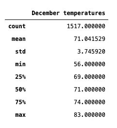

# Surfs Up

## Overview
To determine if a surf and ice cream shop in Oahu, Hawaii is sustainable year-round, I examined Oahu's temperature trends. For the sake of brevity, I only examined June and December temperatures. 

## Results
### Three key differences in weather between June and December are as follows:

June Temperature Trends
* The average temperature was 75
* The highest temperature was 85
* The lowest temperature was 64

December Temperature Trends
* The average temperature is 71
* The highest temperature was 83
* The lowest temperature was 56

## Summary
By gathering temperature at the half way points of the year, a broad picture of the overall temperature trends of Oahu, Hawaii become known. While a low of 56 isn't the most ideal time to surf and eat ice cream, December still has some warmer days with 50% of the data tracking at 71 degrees. I recommend doing additional queries for precipitation and most active stations. These queries will give a more complete understand of all temperature trends and if a surf and ice cream shop in Oahu is sustainable year-round.